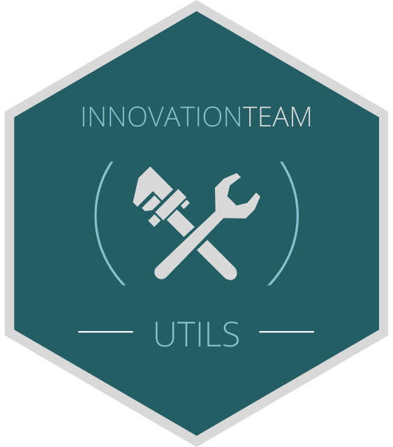

<!-- README.md is generated from README.Rmd. Please edit that file -->

# INNTEAMUTILS <a href="https://mbsconsulting.com"></a>

## Introduction

The `innteamUtils` offers a collection of functions themes and datasets
to enhance productivity on daily coding and reproducibility throughout
the organization.

It is *light on dependencies* (and will be in the future), for better
performance and ease of maintenance. It also, as part of the same
philosophy, adopts “fully integrated end-to-end platform” production
pipeline thanks to the following packages and frameworks:

-   **General Framework**: `data.table` is completely written in base
    `R` and is blazing fast.

-   **Visualization**:

    -   `ggplot2` for static graphics and production-ready plots (the
        only `tidyverse` package).  
    -   `plotly` for interactive graphics as is well-adopted with
        `rmarkdown` and `shiny`.  
    -   `echarts4r` for advanced interactive graphics (*coming soon*).  
    -   `reactable`: for interactive and static production-ready tables.
    -   `reactablefmtr`: for interactive tables and infografics (*Coming
        soon*).  
    -   `bslib` for Shiny apps: **TBD**, probably a template with theme
        options.

-   **Reporting**:

    -   `pagedown`: unique framework for PDF + HTML documentation. Fast
        rendering thanks to `chrome` browsing instead of `LaTeX`.
    -   In a near future we plan to migrate `.Rmd` templates to
        **Quarto** as soon as it is a mature technology.

-   **Machine Learning**: `mlr3verse` which seeks a production-ready
    approach like `python` for `R` and is fully built upon `data.table`
    and uses `R6` objects (for stability and speed).

-   

### License and Permissions

No license, **for Internal Use only**. It is strictly forbidden to
replicate the code outside this repository.

## Installation

The development version can be always installed from
[GitHub](https://github.com/) with:

``` r
# install.packages("devtools")
remotes::install_github("alessio619/innteamUtils", build_vignettes = TRUE)
```

Stable versions contacting by [email](a.abraham@innovationteam.eu). The
latest stable version is `1.0.0`.

## Elements

The main components present in the latest stable version are:  
- **Custom `ggplot2` theme**: calling `plot(...) + theme_innteam()`  
- **Custom `reactable` theme**: calling
`reactable(..., theme = react_format)`  
- **Custom `plotly` theme**: calling
`df %>% plot_ly(...) %>% plotly_innteam()`  
- **Rmarkdown Report Templates**: - *HTML Doc* for quick and light
documents in HTML format.  
- *Paged Report* for professional looking PDF and HTML reports
(lightweight and fast rendering).  
- **Datasets**: tables useful for common issues regarding data cleaning
activities (e.g. `codice_ateco` or `decodifica_comuni`).  
- **Operators**: expansions operators to improve readability of code.
(`%notin%` == `negate(%in%)`).

It also possible and probably more convenient to set the themes in the
session options to avoid verbose code and enable easier reproducibility,
especially on documents:

    theme_set(theme_innteam())
    options(reactable.theme = react_format)

> Next elements under construction are ad-hoc functions in `data.table`
> for data wrangling and manipulation and `mlr3` specific procedures.

## Main Functions

*Coming soon*

## Vignettes

*Coming soon*

## Claims and Issues

For any doubt, idea or issue please contact us via email to:
*<a.abraham@innovatioteam.eu>*
